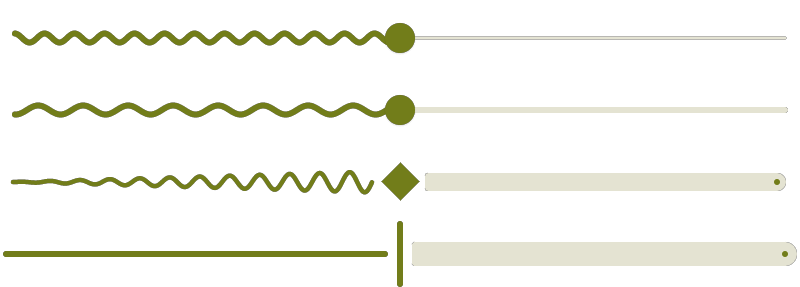

[![Kotlin version]][Kotlin release]
[![Compose Multiplatform version]][Compose Multiplatform release]
[![Latest Maven Central release]][Library on Maven Central]

<br>

<div align="center">
  <picture>
    <source media="(prefers-color-scheme: dark)" srcset="asset/demo-dark.png">
    <source media="(prefers-color-scheme: light)" srcset="asset/demo-light.png">
    
  </picture>
</div>

# Wavy slider

Animated wavy [Material Slider][Material Slider] and progress/seek bar similar to the one used in [**Android 13** media controls][Android 13 media controls].  
It has curly, wobbly, squiggly, wiggly, jiggly, wriggly, dancing movements.
Some users call it the **sperm**.

The library can be used in [Jetpack Compose][Jetpack Compose] and [Compose Multiplatform][Compose Multiplatform] projects like
a regular Material Slider.  
Supported target platforms are Android, iOS, Desktop (JVM), and JavaScript (Kotlin/JS and Kotlin/Wasm).

## Demo
For a live, interactive Web demo go to https://mahozad.ir/wavy-slider.  
For real-world apps in various platforms using the library, see the [showcase](showcase) directory.

## Usage

```kotlin
implementation("ir.mahozad.multiplatform:wavy-slider:2.1.0-rc")
```

<details>

<summary>Setup for multiplatform projects</summary>

If you target a subset of the library supported platforms, add the library to your common source set:

```kotlin
kotlin {
    sourceSets {
        commonMain.dependencies {
            implementation("ir.mahozad.multiplatform:wavy-slider:2.1.0-rc")
            // ...
        }
```

If you have targets that are not supported by the library,
add the library separately to each supported target:

```kotlin
kotlin {
    val desktopMain /* OR jvmMain */ by getting {
        dependencies {
            implementation("ir.mahozad.multiplatform:wavy-slider:2.1.0-rc")
            // ...
        }
    }
    androidMain.dependencies {
        implementation("ir.mahozad.multiplatform:wavy-slider:2.1.0-rc")
        // ...
    }
    // Other targets...
```

</details>

Using the WavySlider is much like using the Material Slider
(you can even make it a regular flat Slider):

```kotlin
import ir.mahozad.multiplatform.wavyslider.material3.WavySlider as WavySlider3
import ir.mahozad.multiplatform.wavyslider.material.WavySlider as WavySlider2
import ir.mahozad.multiplatform.wavyslider.WaveDirection.*

@Composable
fun MyComposable() {
    var fraction by remember { mutableStateOf(0.5f) }
    WavySlider3( // OR WavySlider2( see the imports above that use "as ..."
        value = fraction,
        onValueChange = { fraction = it },
        waveLength = 16.dp,     // Set this to 0.dp to make the Slider flat
        waveHeight = 16.dp,     // Set this to 0.dp to make the Slider flat
        waveVelocity = 15.dp to HEAD, // Speed per second and its direction
        waveThickness = 4.dp,   // Defaults to 4.dp irregardless of variant
        trackThickness = 4.dp,  // Defaults to a thickness based on variant
        incremental = false,    // Whether to gradually increase waveHeight
        // animationSpecs = ... // Customize various animations of the wave
        // Other options that are available in standard Material 2/3 Slider
    )
}
```

## Related
  - AOSP native squiggly progress: [Main branch][Android main branch implementation] ❖ [Android 14][Android 14 branch implementation] ❖ [Android 13][Android 13 branch implementation]
  - LinearWavyProgressIndicator (available since [Material 3 v1.4.0-alpha01][Material 3 v1.4.0-alpha01])
  - Squiggly slider (Android-only): https://github.com/saket/squiggly-slider
  - Wave slider (Android-only): https://github.com/galaxygoldfish/waveslider
  - Squiggly seekbar (Flutter): https://github.com/hannesgith/squiggly_slider
  - Sliders with custom styles: https://github.com/krottv/compose-sliders
  - Customizable seeker/slider: https://github.com/2307vivek/Seeker
  - Squiggly text underlines: https://github.com/saket/ExtendedSpans
  - Waveform seekbar: https://github.com/massoudss/waveformSeekBar
  - Colorful sliders: https://github.com/SmartToolFactory/Compose-Colorful-Sliders
  - StackOverflow posts:
    + [How to create the Android 13 squiggly slider using Jetpack Compose?](https://stackoverflow.com/q/77927207/8583692) 
    + [Implement new slider in Android 13 media player via Jetpack Compose](https://stackoverflow.com/q/75268182/8583692)
    + [Wave like seek bar for music player app in android jetpack compose](https://stackoverflow.com/q/77661902/8583692)
    + [Squiggly Seekbar with Animation in Flutter](https://stackoverflow.com/q/75889414/8583692)
    + [Is it possible to make a squiggly line?](https://stackoverflow.com/q/17285514/8583692)

[Kotlin version]: https://img.shields.io/badge/Kotlin-2.2.0--Beta2-303030.svg?labelColor=303030&logo=data:image/svg+xml;base64,PHN2ZyB2ZXJzaW9uPSIxLjEiIHZpZXdCb3g9IjAgMCAxOC45MyAxOC45MiIgd2lkdGg9IjE4IiBoZWlnaHQ9IjE4IiB4bWxucz0iaHR0cDovL3d3dy53My5vcmcvMjAwMC9zdmciPgogIDxyYWRpYWxHcmFkaWVudCBpZD0iZ3JhZGllbnQiIHI9IjIxLjY3OSIgY3g9IjIyLjQzMiIgY3k9IjMuNDkzIiBncmFkaWVudFRyYW5zZm9ybT0ibWF0cml4KDEgMCAwIDEgLTQuMTMgLTIuNzE4KSIgZ3JhZGllbnRVbml0cz0idXNlclNwYWNlT25Vc2UiPgogICAgPHN0b3Agc3RvcC1jb2xvcj0iI2U0NDg1NyIgb2Zmc2V0PSIuMDAzIi8+CiAgICA8c3RvcCBzdG9wLWNvbG9yPSIjYzcxMWUxIiBvZmZzZXQ9Ii40NjkiLz4KICAgIDxzdG9wIHN0b3AtY29sb3I9IiM3ZjUyZmYiIG9mZnNldD0iMSIvPgogIDwvcmFkaWFsR3JhZGllbnQ+CiAgPHBhdGggZmlsbD0idXJsKCNncmFkaWVudCkiIGQ9Ik0gMTguOTMsMTguOTIgSCAwIFYgMCBIIDE4LjkzIEwgOS4yNyw5LjMyIFoiLz4KPC9zdmc+Cg==
[Compose Multiplatform version]: https://img.shields.io/badge/Compose_Multiplatform-1.8.0-303030.svg?labelColor=303030&logo=data:image/svg+xml;base64,PHN2ZyBmaWxsPSJub25lIiBoZWlnaHQ9IjU2IiB2aWV3Qm94PSIwIDAgNTAgNTYiIHdpZHRoPSI1MCIgeG1sbnM9Imh0dHA6Ly93d3cudzMub3JnLzIwMDAvc3ZnIiB4bWxuczp4bGluaz0iaHR0cDovL3d3dy53My5vcmcvMTk5OS94bGluayI+PHJhZGlhbEdyYWRpZW50IGlkPSJhIiBjeD0iMCIgY3k9IjAiIGdyYWRpZW50VHJhbnNmb3JtPSJtYXRyaXgoNDIuMTMxNSAwIDAgNDIuMTMxOCAxNi4xMzA2IDE0LjQ0MTIpIiBncmFkaWVudFVuaXRzPSJ1c2VyU3BhY2VPblVzZSIgcj0iMSI+PHN0b3Agb2Zmc2V0PSIwIiBzdG9wLWNvbG9yPSIjNTM4M2VjIi8+PHN0b3Agb2Zmc2V0PSIuODY2OTkiIHN0b3AtY29sb3I9IiM3ZjUyZmYiLz48L3JhZGlhbEdyYWRpZW50PjxsaW5lYXJHcmFkaWVudCBpZD0iYiIgZ3JhZGllbnRVbml0cz0idXNlclNwYWNlT25Vc2UiIHgxPSIzNy4xNzE5IiB4Mj0iMTAuOTczMyIgeTE9Ii4zNzY2MzgiIHkyPSIzMC4wMzUzIj48c3RvcCBvZmZzZXQ9IjAiIHN0b3AtY29sb3I9IiMzM2MzZmYiLz48c3RvcCBvZmZzZXQ9Ii44Nzg0MyIgc3RvcC1jb2xvcj0iIzUzODNlYyIvPjwvbGluZWFyR3JhZGllbnQ+PHBhdGggZD0ibTQ5LjI1IDE0djI4bC0yNC4yNSAxNC0yNC4yNS0xNHYtMjhsMjQuMjUtMTR6IiBmaWxsPSIjNjA3NWYyIi8+PHBhdGggZD0ibTM0LjUgMjIuNXYxMWwtOS41IDUuNXYxN2wyNC4yNS0xNHYtMjh6IiBmaWxsPSIjNmI1N2ZmIi8+PHBhdGggZD0ibTI1IDM5LTkuNS01LjV2LTExbC0xNC43NS04LjV2MjhsMjQuMjUgMTR6IiBmaWxsPSJ1cmwoI2EpIi8+PHBhdGggZD0ibTE1LjUgMjIuNSA5LjUtNS41IDkuNSA1LjUgMTQuNzUtOC41LTI0LjI1LTE0LTI0LjI1IDE0eiIgZmlsbD0idXJsKCNiKSIvPjxwYXRoIGQ9Im0yNSAxNyA5LjUyNjMgNS41djExbC05LjUyNjMgNS41LTkuNTI2My01LjV2LTExeiIgZmlsbD0iIzAwMCIvPjwvc3ZnPg==
[Latest Maven Central release]: https://img.shields.io/maven-central/v/ir.mahozad.multiplatform/wavy-slider?label=Maven%20Central&labelColor=303030&logo=data:image/svg+xml;base64,PHN2ZyB3aWR0aD0iMTYiIGhlaWdodD0iMTYiIHZlcnNpb249IjEuMSIgdmlld0JveD0iMCAwIDE2IDE2IiB4bWxucz0iaHR0cDovL3d3dy53My5vcmcvMjAwMC9zdmciPgogIDxkZWZzPgogICAgPHN0eWxlPi5he2ZpbGw6bm9uZTt9LmJ7Y2xpcC1wYXRoOnVybCgjYSk7fS5je2ZpbGw6I2ZmZjt9PC9zdHlsZT4KICAgIDxjbGlwUGF0aCBpZD0iYSI+CiAgICAgIDxyZWN0IGNsYXNzPSJhIiB4PSIxNC43IiB5PSIxMSIgd2lkdGg9IjE3MSIgaGVpZ2h0PSIxNTEiLz4KICAgIDwvY2xpcFBhdGg+CiAgICA8Y2xpcFBhdGggaWQ9ImNsaXBQYXRoMTMiPgogICAgICA8cmVjdCBjbGFzcz0iYSIgeD0iMTQuNyIgeT0iMTEiIHdpZHRoPSIxNzEiIGhlaWdodD0iMTUxIi8+CiAgICA8L2NsaXBQYXRoPgogIDwvZGVmcz4KICA8cGF0aCBjbGFzcz0iYyIgdHJhbnNmb3JtPSJtYXRyaXgoLjE2NCAwIDAgLjE2NCAtOC4zNyAtMS44MSkiIGQ9Im0xMDAgMTEtNDIuMyAyNC40djQ4LjlsNDIuMyAyNC40IDQyLjMtMjQuNHYtNDguOXptMzAuMiA2Ni4zLTMwLjIgMTcuNC0zMC4yLTE3LjR2LTM0LjlsMzAuMi0xNy40IDMwLjIgMTcuNHoiIGNsaXAtcGF0aD0idXJsKCNjbGlwUGF0aDEzKSIvPgo8L3N2Zz4K
[Kotlin release]: https://github.com/JetBrains/kotlin/releases/tag/v2.2.0-Beta2
[Compose Multiplatform release]: https://github.com/JetBrains/compose-multiplatform/releases/tag/v1.8.0
[Library on Maven Central]: https://repo1.maven.org/maven2/ir/mahozad/multiplatform/wavy-slider/2.1.0-rc/
[Material Slider]: https://m3.material.io/components/sliders/overview
[Android 13 media controls]: https://www.xda-developers.com/android-13-beta-1-media-controls-animation/
[Jetpack Compose]: https://developer.android.com/jetpack/compose
[Compose Multiplatform]: https://github.com/JetBrains/compose-multiplatform
[Android main branch implementation]: https://android.googlesource.com/platform/frameworks/base/+/refs/heads/main/packages/SystemUI/src/com/android/systemui/media/controls/ui/drawable/SquigglyProgress.kt
[Android 14 branch implementation]: https://android.googlesource.com/platform/frameworks/base/+/refs/heads/android14-release/packages/SystemUI/src/com/android/systemui/media/controls/ui/SquigglyProgress.kt
[Android 13 branch implementation]: https://android.googlesource.com/platform/frameworks/base/+/refs/heads/android13-release/packages/SystemUI/src/com/android/systemui/media/SquigglyProgress.kt
[Material 3 v1.4.0-alpha01]: https://github.com/androidx/androidx/blob/androidx-main/compose/material3/material3/src/commonMain/kotlin/androidx/compose/material3/WavyProgressIndicator.kt#L132
