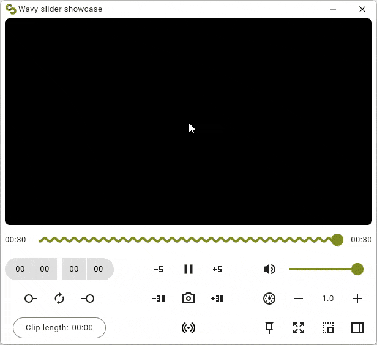

![Kotlin version]
![Compose Multiplatform version]
![Latest Maven Central release]

<div align="center">
    
</div>

<br>

<div align="center">
    
</div>

# Wavy slider

This is an animated Material wavy slider and progress bar similar to the one introduced in **Android 13** media player.  
It has curly, wobbly, squiggly, wiggly, jiggly, wriggly, dancing movements.
Some users call it the **sperm**.

The library can be used in [Jetpack Compose](https://developer.android.com/jetpack/compose) and [Compose Multiplatform](https://github.com/JetBrains/compose-multiplatform) projects like
a regular [Material Slider](https://developer.android.com/reference/kotlin/androidx/compose/material3/package-summary#Slider(kotlin.Float,kotlin.Function1,androidx.compose.ui.Modifier,kotlin.Boolean,kotlin.ranges.ClosedFloatingPointRange,kotlin.Int,kotlin.Function0,androidx.compose.material3.SliderColors,androidx.compose.foundation.interaction.MutableInteractionSource)).  
Supported target platforms are Android, IOS, Desktop, and JavaScript (Kotlin/JS).

## Demo
For a live, interactive demo go to https://mahozad.ir/wavy-slider.  
For real-world apps in various platforms using the library, see the [showcase](showcase) directory.

## Getting started

For a single-platform project (Android or IOS or Desktop or JS):

```kotlin
dependencies {
    implementation/* OR api */("ir.mahozad.multiplatform:wavy-slider:0.4.0")
}
```

For a multiplatform project (if you target a subset of the library supported platforms):

```kotlin
kotlin {
    sourceSets {
        commonMain.dependencies {
            implementation/* OR api */("ir.mahozad.multiplatform:wavy-slider:0.4.0")
        }
// ...
```

If you have targets that are not supported by the library,
add the library separately to each supported target:

```kotlin
kotlin {
    val desktopMain /* OR jvmMain */ by getting {
        dependencies {
            implementation/* OR api */("ir.mahozad.multiplatform:wavy-slider:0.4.0")
        }
    }
    androidMain.dependencies {
        implementation/* OR api */("ir.mahozad.multiplatform:wavy-slider:0.4.0")
    }
    // etc.
```

Using the WavySlider is much like using the Material Slider
(set `waveHeight` to `0.dp` to turn it into a flat slider):

```kotlin
import ir.mahozad.multiplatform.wavyslider.material/*OR material3*/.WavySlider

@Composable
fun MyComposable() {
    var fraction by remember { mutableStateOf(0.5f) }
    WavySlider(
        value = fraction,
        waveLength = 16.dp,    // Defaults to a dp based on platform
        waveHeight = 16.dp,    // Set this to 0.dp to get a regular Slider
        shouldFlatten = false, // Defaults to false
        waveThickness = 4.dp,  // Defaults to the track thickness
        trackThickness = 4.dp, // Defaults to a dp based on platform
        animationDirection = UNSPECIFIED, // Defaults to UNSPECIFIED
        onValueChange = { fraction = it }
    )
}
```

## Similar alternative library
https://github.com/galaxygoldfish/waveslider  
It is not multiplatform and also occasionally glitches (the last time I checked).

## Misc
When animation direction is LTR, the tail sometimes is not long enough

Android 13 music player: https://android.googlesource.com/platform/packages/apps/Music/

Multiplatform Compose library examples:
  - https://github.com/mori-atsushi/insetsx
  - https://github.com/jordond/drag-select-compose

Site for inspiration: https://terrakok.github.io/Compose-Multiplatform-Wizard/

[Kotlin version]: https://img.shields.io/badge/Kotlin-1.9.21-303030.svg?labelColor=303030&logo=data:image/svg+xml;base64,PHN2ZyB2ZXJzaW9uPSIxLjEiIHZpZXdCb3g9IjAgMCAxOC45MyAxOC45MiIgd2lkdGg9IjE4IiBoZWlnaHQ9IjE4IiB4bWxucz0iaHR0cDovL3d3dy53My5vcmcvMjAwMC9zdmciPgogIDxyYWRpYWxHcmFkaWVudCBpZD0iZ3JhZGllbnQiIHI9IjIxLjY3OSIgY3g9IjIyLjQzMiIgY3k9IjMuNDkzIiBncmFkaWVudFRyYW5zZm9ybT0ibWF0cml4KDEgMCAwIDEgLTQuMTMgLTIuNzE4KSIgZ3JhZGllbnRVbml0cz0idXNlclNwYWNlT25Vc2UiPgogICAgPHN0b3Agc3RvcC1jb2xvcj0iI2U0NDg1NyIgb2Zmc2V0PSIuMDAzIi8+CiAgICA8c3RvcCBzdG9wLWNvbG9yPSIjYzcxMWUxIiBvZmZzZXQ9Ii40NjkiLz4KICAgIDxzdG9wIHN0b3AtY29sb3I9IiM3ZjUyZmYiIG9mZnNldD0iMSIvPgogIDwvcmFkaWFsR3JhZGllbnQ+CiAgPHBhdGggZmlsbD0idXJsKCNncmFkaWVudCkiIGQ9Ik0gMTguOTMsMTguOTIgSCAwIFYgMCBIIDE4LjkzIEwgOS4yNyw5LjMyIFoiLz4KPC9zdmc+Cg==
[Compose Multiplatform version]: https://img.shields.io/badge/Compose_Multiplatform-1.5.11-303030.svg?labelColor=303030&logo=data:image/png;base64,iVBORw0KGgoAAAANSUhEUgAAABAAAAAQCAYAAAAf8/9hAAAACXBIWXMAAA7DAAAOwwHHb6hkAAAAGXRFWHRTb2Z0d2FyZQB3d3cuaW5rc2NhcGUub3Jnm+48GgAAAj5JREFUOI2Vk0FIVFEUhv9znBllplBIF7loK1jtJKhFNG/EVtYicNkmKghCMpJGq0HoPcWQVi2KUMqdixaJi0KdXVBILQojs4wCaTGC4LyX+N47fwtFpnEKOnDh3p//fudeDr+QRK3KukGHCscAwCjXi4PphVo+qQZkhzaa61J6m8RhAfpisS01HQOwZin0F29kftYEdDxCsqnkX6HgIonR+YHM00pjzg26oXRBPrNw30ixgM1dgDMcnFFyyIAphpn7xQI2Tw6XW5LQO0L+isPQKxaa1rNDaJCkf02BHhMpzOfTzxUA1GyCxEcFxjcOIu50/b4kZQnkZQJ9mkwuOV5wqaUdYSIhTwBZFto4AOj2R+S7qEwZMNtU8lcoGAPximZHDegAsCjgw7XP/rJFnDHBhEB+AABIIueW35FEdsQ/67hl5jz/AklUrpxX7nfcMp27wYnKO/rHCAwhANDkffW4DPJhZxtV6lpt/N+qCRCND+3RDHs0AEhUHii6KIxXSZnq9PxJTUhetrQ+VrsH4TlAvlgUfd3zAgMau0aD1uLNhm8WBm0CjBDoiSN8ijReJHBaRAYtTB8pFvaXukaDVgMadwFC6bWIM47n54GWaHYgM5CwunaASwBe1yXQNptPewDgeH7eIs4IpXcXMDeYnl5vzhxTINCUv+B4/vkXtxpWQEwK8Phlf3o15wbdmvLfCFgfh5njc4Pp6e3mVWHqHN44AOidnTC9NVpJRE+BKP0zTNW1HWc8IMxIvfq3OP8GvjkzgYHHZZMAAAAASUVORK5CYII=
[Latest Maven Central release]: https://img.shields.io/maven-central/v/ir.mahozad.multiplatform/wavy-slider?label=Maven%20Central&labelColor=303030&logo=data:image/svg+xml;base64,PHN2ZyB3aWR0aD0iMTYiIGhlaWdodD0iMTYiIHZlcnNpb249IjEuMSIgdmlld0JveD0iMCAwIDE2IDE2IiB4bWxucz0iaHR0cDovL3d3dy53My5vcmcvMjAwMC9zdmciPgogIDxkZWZzPgogICAgPHN0eWxlPi5he2ZpbGw6bm9uZTt9LmJ7Y2xpcC1wYXRoOnVybCgjYSk7fS5je2ZpbGw6I2ZmZjt9PC9zdHlsZT4KICAgIDxjbGlwUGF0aCBpZD0iYSI+CiAgICAgIDxyZWN0IGNsYXNzPSJhIiB4PSIxNC43IiB5PSIxMSIgd2lkdGg9IjE3MSIgaGVpZ2h0PSIxNTEiLz4KICAgIDwvY2xpcFBhdGg+CiAgICA8Y2xpcFBhdGggaWQ9ImNsaXBQYXRoMTMiPgogICAgICA8cmVjdCBjbGFzcz0iYSIgeD0iMTQuNyIgeT0iMTEiIHdpZHRoPSIxNzEiIGhlaWdodD0iMTUxIi8+CiAgICA8L2NsaXBQYXRoPgogIDwvZGVmcz4KICA8cGF0aCBjbGFzcz0iYyIgdHJhbnNmb3JtPSJtYXRyaXgoLjE2NCAwIDAgLjE2NCAtOC4zNyAtMS44MSkiIGQ9Im0xMDAgMTEtNDIuMyAyNC40djQ4LjlsNDIuMyAyNC40IDQyLjMtMjQuNHYtNDguOXptMzAuMiA2Ni4zLTMwLjIgMTcuNC0zMC4yLTE3LjR2LTM0LjlsMzAuMi0xNy40IDMwLjIgMTcuNHoiIGNsaXAtcGF0aD0idXJsKCNjbGlwUGF0aDEzKSIvPgo8L3N2Zz4K
